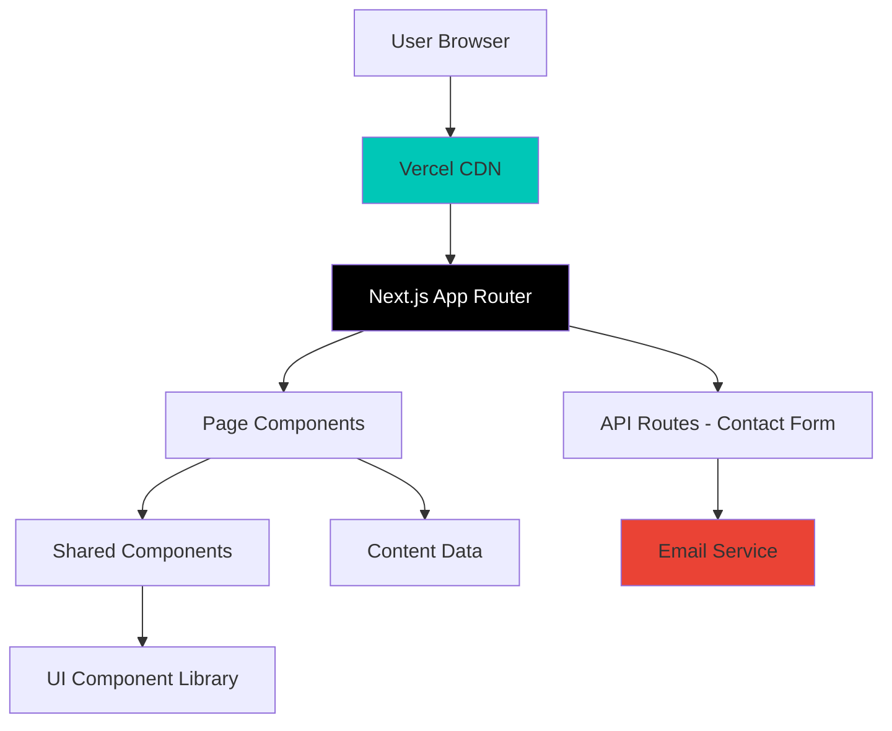
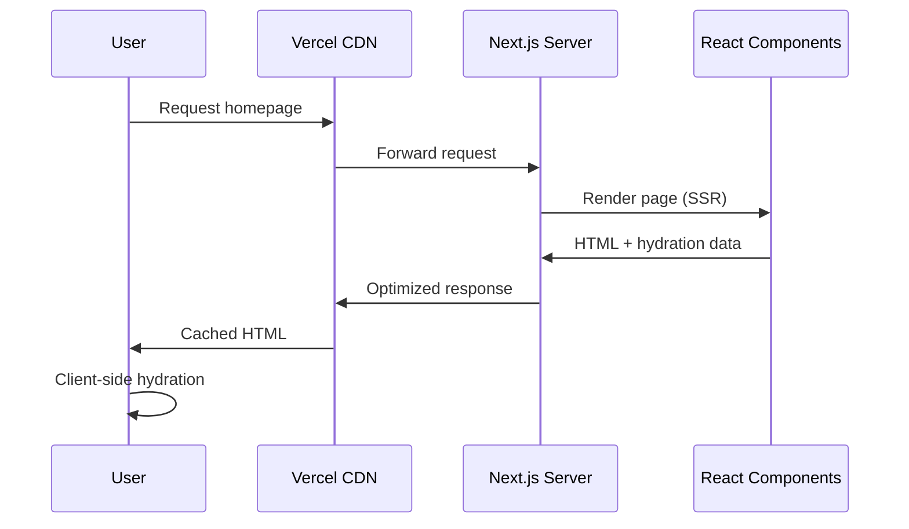
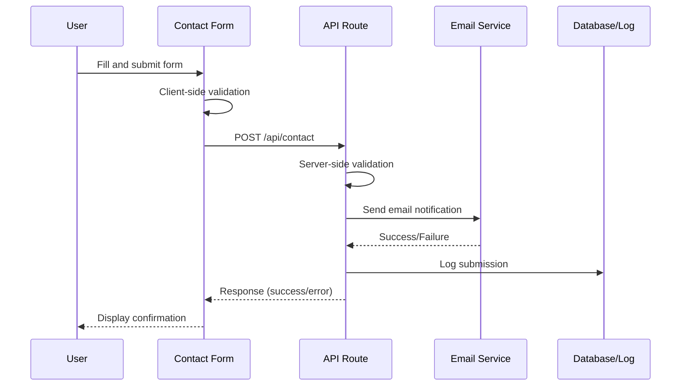
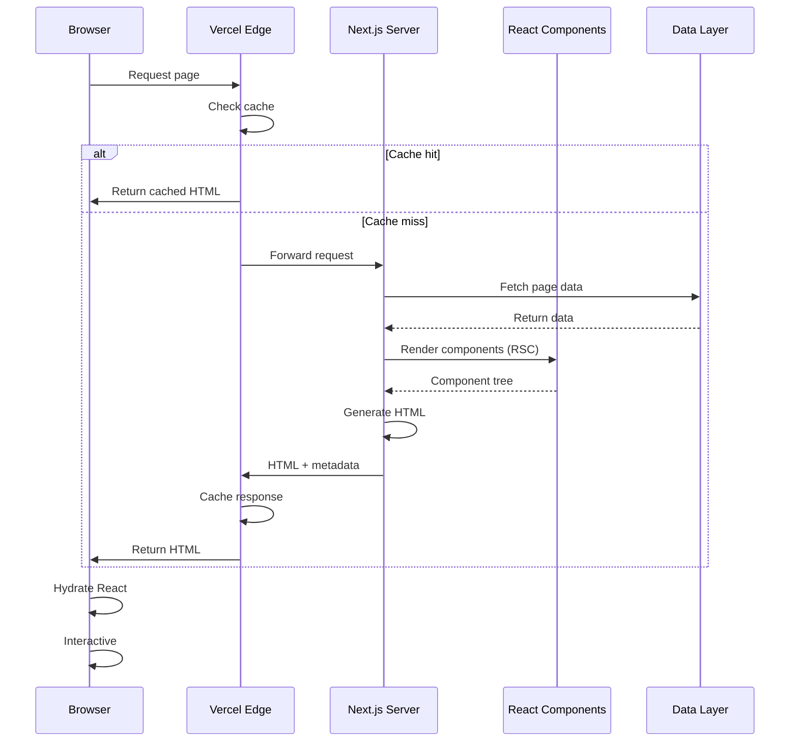

# Design Document: Nelson Islamic Cultural Society Website

## Overview

The Nelson Islamic Cultural Society website is a modern, production-ready web application designed to inform visitors about the Islamic community in Nelson, New Zealand. The website serves as the primary digital presence for the society, providing essential information through four main sections: Homepage, About Us, FAQ, and Contact Us. Built with Next.js 14 and deployed on Vercel, the site emphasizes modern UI/UX principles, accessibility, and performance optimization to create an welcoming and informative experience for all visitors.

The architecture follows a static-first approach with server-side rendering capabilities, leveraging Next.js App Router for optimal performance and SEO. The design prioritizes mobile responsiveness, fast load times, and intuitive navigation while maintaining cultural sensitivity and professional presentation.

## Architecture



### Architecture Layers

1. **Presentation Layer**: Next.js 14 App Router with React Server Components
2. **Component Layer**: Reusable UI components with Tailwind CSS styling
3. **Data Layer**: Static content with structured data for SEO
4. **API Layer**: Serverless functions for contact form submission
5. **Deployment Layer**: Vercel platform with automatic HTTPS and CDN

## Sequence Diagrams

### Homepage Load Flow



### Contact Form Submission Flow



## Components and Interfaces

### Component 1: Layout

**Purpose**: Provides consistent structure across all pages with header, navigation, and footer

**Interface**:
```typescript
interface LayoutProps {
  children: React.ReactNode;
  className?: string;
}

export default function Layout({ children, className }: LayoutProps): JSX.Element
```

**Responsibilities**:
- Render consistent header with logo and navigation
- Provide responsive navigation menu (mobile hamburger menu)
- Display footer with contact information and social links
- Manage page structure and spacing

### Component 2: Navigation

**Purpose**: Handles site navigation with responsive behavior

**Interface**:
```typescript
interface NavigationProps {
  currentPath: string;
  className?: string;
}

interface NavItem {
  label: string;
  href: string;
  icon?: React.ReactNode;
}

export function Navigation({ currentPath, className }: NavigationProps): JSX.Element
```

**Responsibilities**:
- Display navigation links with active state highlighting
- Implement mobile hamburger menu with smooth transitions
- Handle keyboard navigation for accessibility
- Support smooth scrolling to sections

### Component 3: Hero Section

**Purpose**: Eye-catching introduction section for homepage

**Interface**:
```typescript
interface HeroProps {
  title: string;
  subtitle: string;
  backgroundImage?: string;
  ctaButton?: {
    text: string;
    href: string;
  };
}

export function Hero({ title, subtitle, backgroundImage, ctaButton }: HeroProps): JSX.Element
```

**Responsibilities**:
- Display prominent title and subtitle
- Render background image with overlay
- Provide call-to-action button
- Ensure text readability over images

### Component 4: Contact Form

**Purpose**: Collects visitor inquiries and feedback

**Interface**:
```typescript
interface ContactFormProps {
  onSuccess?: () => void;
  onError?: (error: Error) => void;
}

interface ContactFormData {
  name: string;
  email: string;
  subject: string;
  message: string;
}

export function ContactForm({ onSuccess, onError }: ContactFormProps): JSX.Element
```

**Responsibilities**:
- Validate form inputs (client-side and server-side)
- Handle form submission with loading states
- Display success/error messages
- Implement spam protection (honeypot field)
- Ensure accessibility with proper labels and ARIA attributes

### Component 5: FAQ Accordion

**Purpose**: Displays frequently asked questions in expandable format

**Interface**:
```typescript
interface FAQItem {
  id: string;
  question: string;
  answer: string;
}

interface FAQAccordionProps {
  items: FAQItem[];
  defaultOpenId?: string;
}

export function FAQAccordion({ items, defaultOpenId }: FAQAccordionProps): JSX.Element
```

**Responsibilities**:
- Render questions with expand/collapse functionality
- Support keyboard navigation (arrow keys, Enter, Space)
- Animate transitions smoothly
- Allow multiple items open simultaneously or single-item mode

### Component 6: Card

**Purpose**: Reusable card component for content sections

**Interface**:
```typescript
interface CardProps {
  title: string;
  description: string;
  icon?: React.ReactNode;
  href?: string;
  className?: string;
}

export function Card({ title, description, icon, href, className }: CardProps): JSX.Element
```

**Responsibilities**:
- Display content in visually appealing card format
- Support optional icons and links
- Provide hover effects and transitions
- Maintain consistent spacing and typography

## Data Models

### ContactSubmission

```typescript
interface ContactSubmission {
  id: string;
  name: string;
  email: string;
  subject: string;
  message: string;
  timestamp: Date;
  ipAddress?: string;
  userAgent?: string;
  status: 'pending' | 'sent' | 'failed';
}
```

**Validation Rules**:
- `name`: Required, 2-100 characters, no special characters except spaces, hyphens, apostrophes
- `email`: Required, valid email format (RFC 5322)
- `subject`: Required, 5-200 characters
- `message`: Required, 10-2000 characters
- `timestamp`: Auto-generated on submission
- `status`: Defaults to 'pending', updated after email send attempt

### SiteMetadata

```typescript
interface SiteMetadata {
  title: string;
  description: string;
  url: string;
  locale: string;
  siteName: string;
  images: {
    url: string;
    width: number;
    height: number;
    alt: string;
  }[];
  contact: {
    email: string;
    phone?: string;
    address?: string;
  };
  social: {
    facebook?: string;
    twitter?: string;
    instagram?: string;
  };
}
```

**Validation Rules**:
- `title`: Required, 10-60 characters for SEO
- `description`: Required, 50-160 characters for SEO
- `url`: Required, valid HTTPS URL
- `locale`: Required, valid locale code (e.g., 'en-NZ')
- `images`: At least one image for social sharing
- `contact.email`: Required, valid email format

### FAQData

```typescript
interface FAQData {
  id: string;
  question: string;
  answer: string;
  category?: string;
  order: number;
}
```

**Validation Rules**:
- `id`: Required, unique identifier
- `question`: Required, 10-200 characters
- `answer`: Required, 20-1000 characters, supports markdown
- `order`: Required, positive integer for sorting

## Main Algorithm/Workflow

### Page Rendering Workflow



## Key Functions with Formal Specifications

### Function 1: validateContactForm()

```typescript
function validateContactForm(data: ContactFormData): ValidationResult
```

**Preconditions:**
- `data` is a non-null object
- `data` contains all required fields: name, email, subject, message

**Postconditions:**
- Returns `ValidationResult` object with `isValid` boolean and `errors` array
- If `isValid === true`, then `errors` array is empty
- If `isValid === false`, then `errors` array contains at least one error message
- No mutations to input `data` parameter

**Loop Invariants:** N/A (no loops in validation logic)

### Function 2: submitContactForm()

```typescript
async function submitContactForm(data: ContactFormData): Promise<SubmissionResult>
```

**Preconditions:**
- `data` has passed client-side validation
- `data.email` is a valid email format
- `data.message` length is between 10 and 2000 characters
- Network connection is available

**Postconditions:**
- Returns `SubmissionResult` with `success` boolean and optional `error` message
- If `success === true`, email has been sent and submission logged
- If `success === false`, `error` contains descriptive message
- Original `data` is not mutated
- Side effect: Email sent to society contact address
- Side effect: Submission logged for record-keeping

**Loop Invariants:** N/A

### Function 3: renderPage()

```typescript
async function renderPage(pathname: string): Promise<PageResponse>
```

**Preconditions:**
- `pathname` is a valid route string
- `pathname` matches one of: '/', '/about', '/faq', '/contact'
- Server environment is properly configured

**Postconditions:**
- Returns `PageResponse` with HTML string and metadata
- HTML is valid and well-formed
- Metadata includes SEO tags and Open Graph data
- Response is cacheable by CDN
- No side effects on server state

**Loop Invariants:** N/A

## Algorithmic Pseudocode

### Contact Form Submission Algorithm

```typescript
async function handleContactFormSubmission(formData: ContactFormData): Promise<SubmissionResult> {
  // Step 1: Client-side validation
  const clientValidation = validateContactForm(formData);
  
  if (!clientValidation.isValid) {
    return {
      success: false,
      error: clientValidation.errors.join(', ')
    };
  }
  
  // Step 2: Submit to API route
  try {
    const response = await fetch('/api/contact', {
      method: 'POST',
      headers: { 'Content-Type': 'application/json' },
      body: JSON.stringify(formData)
    });
    
    const result = await response.json();
    
    if (!response.ok) {
      return {
        success: false,
        error: result.error || 'Submission failed'
      };
    }
    
    return {
      success: true,
      message: 'Thank you for your message. We will respond soon.'
    };
    
  } catch (error) {
    return {
      success: false,
      error: 'Network error. Please try again.'
    };
  }
}
```

**Preconditions:**
- `formData` contains all required fields
- Browser supports fetch API
- Network connection is available

**Postconditions:**
- Returns result indicating success or failure
- If successful, form data has been sent to server
- If failed, error message describes the issue
- No data corruption occurs

### Page Navigation Algorithm

```typescript
function handleNavigation(targetPath: string, currentPath: string): void {
  // Step 1: Check if navigation is needed
  if (targetPath === currentPath) {
    return; // Already on target page
  }
  
  // Step 2: Update active state in navigation
  updateActiveNavItem(targetPath);
  
  // Step 3: Perform client-side navigation (Next.js router)
  router.push(targetPath);
  
  // Step 4: Scroll to top smoothly
  window.scrollTo({ top: 0, behavior: 'smooth' });
  
  // Step 5: Update document title
  updateDocumentTitle(targetPath);
}
```

**Preconditions:**
- `targetPath` is a valid route
- `currentPath` represents the current location
- Router is initialized

**Postconditions:**
- User is navigated to target page
- Active navigation item is updated
- Page scrolls to top
- Document title reflects new page
- Browser history is updated

### FAQ Accordion Toggle Algorithm

```typescript
function toggleFAQItem(itemId: string, openItems: Set<string>): Set<string> {
  const newOpenItems = new Set(openItems);
  
  if (newOpenItems.has(itemId)) {
    // Item is open, close it
    newOpenItems.delete(itemId);
  } else {
    // Item is closed, open it
    newOpenItems.add(itemId);
  }
  
  return newOpenItems;
}
```

**Preconditions:**
- `itemId` is a valid FAQ item identifier
- `openItems` is a Set containing currently open item IDs

**Postconditions:**
- Returns new Set with updated open state
- If item was open, it is now closed (removed from Set)
- If item was closed, it is now open (added to Set)
- Original `openItems` Set is not mutated (immutable update)

**Loop Invariants:** N/A

## Example Usage

### Example 1: Contact Form Component Usage

```typescript
// In app/contact/page.tsx
import { ContactForm } from '@/components/ContactForm';

export default function ContactPage() {
  return (
    <div className="container mx-auto px-4 py-12">
      <h1 className="text-4xl font-bold mb-8">Contact Us</h1>
      
      <ContactForm
        onSuccess={() => {
          console.log('Form submitted successfully');
          // Could show a success toast notification
        }}
        onError={(error) => {
          console.error('Form submission failed:', error);
          // Could show an error toast notification
        }}
      />
    </div>
  );
}
```

### Example 2: FAQ Accordion Usage

```typescript
// In app/faq/page.tsx
import { FAQAccordion } from '@/components/FAQAccordion';

const faqData = [
  {
    id: 'prayer-times',
    question: 'What are the prayer times?',
    answer: 'Prayer times vary by season. Please check our homepage for current times.'
  },
  {
    id: 'location',
    question: 'Where is the mosque located?',
    answer: 'We are located at [address]. Parking is available on-site.'
  }
];

export default function FAQPage() {
  return (
    <div className="container mx-auto px-4 py-12">
      <h1 className="text-4xl font-bold mb-8">Frequently Asked Questions</h1>
      <FAQAccordion items={faqData} defaultOpenId="prayer-times" />
    </div>
  );
}
```

### Example 3: API Route for Contact Form

```typescript
// In app/api/contact/route.ts
import { NextRequest, NextResponse } from 'next/server';
import { sendEmail } from '@/lib/email';

export async function POST(request: NextRequest) {
  try {
    const data = await request.json();
    
    // Server-side validation
    const validation = validateContactForm(data);
    if (!validation.isValid) {
      return NextResponse.json(
        { error: validation.errors.join(', ') },
        { status: 400 }
      );
    }
    
    // Send email
    await sendEmail({
      to: process.env.CONTACT_EMAIL!,
      subject: `Contact Form: ${data.subject}`,
      html: `
        <h2>New Contact Form Submission</h2>
        <p><strong>Name:</strong> ${data.name}</p>
        <p><strong>Email:</strong> ${data.email}</p>
        <p><strong>Subject:</strong> ${data.subject}</p>
        <p><strong>Message:</strong></p>
        <p>${data.message}</p>
      `
    });
    
    return NextResponse.json({ success: true });
    
  } catch (error) {
    console.error('Contact form error:', error);
    return NextResponse.json(
      { error: 'Failed to send message' },
      { status: 500 }
    );
  }
}
```

## Correctness Properties

### Universal Quantification Statements

1. **Form Validation Property**:
   - ∀ formData ∈ ContactFormData: validateContactForm(formData).isValid = true ⟹ (formData.email matches RFC 5322 ∧ formData.name.length ≥ 2 ∧ formData.message.length ≥ 10)

2. **Navigation Consistency Property**:
   - ∀ path ∈ ValidRoutes: renderPage(path) returns valid HTML ∧ includes proper metadata

3. **Accessibility Property**:
   - ∀ component ∈ UIComponents: component has proper ARIA labels ∧ supports keyboard navigation

4. **Responsive Design Property**:
   - ∀ viewport ∈ [320px, 3840px]: layout renders correctly ∧ content is readable ∧ interactive elements are accessible

5. **Performance Property**:
   - ∀ page ∈ Pages: First Contentful Paint < 1.5s ∧ Largest Contentful Paint < 2.5s ∧ Cumulative Layout Shift < 0.1

6. **SEO Property**:
   - ∀ page ∈ Pages: page includes title tag ∧ meta description ∧ Open Graph tags ∧ structured data

## Error Handling

### Error Scenario 1: Contact Form Submission Failure

**Condition**: Network error or server error during form submission
**Response**: Display user-friendly error message, preserve form data
**Recovery**: Allow user to retry submission, log error for debugging

### Error Scenario 2: Invalid Email Format

**Condition**: User enters malformed email address
**Response**: Show inline validation error below email field
**Recovery**: Prevent form submission until valid email is entered

### Error Scenario 3: Page Not Found (404)

**Condition**: User navigates to non-existent route
**Response**: Display custom 404 page with navigation options
**Recovery**: Provide links to main pages, search functionality

### Error Scenario 4: API Rate Limiting

**Condition**: Too many contact form submissions from same IP
**Response**: Return 429 status with retry-after header
**Recovery**: Display message asking user to wait before resubmitting

### Error Scenario 5: Email Service Failure

**Condition**: Email service (e.g., SendGrid) is unavailable
**Response**: Log submission to database, queue for retry
**Recovery**: Implement exponential backoff retry mechanism, notify admin

## Testing Strategy

### Unit Testing Approach

**Framework**: Jest + React Testing Library

**Key Test Cases**:
1. **Component Rendering**: Verify all components render without errors
2. **Form Validation**: Test all validation rules with valid and invalid inputs
3. **User Interactions**: Test button clicks, form submissions, accordion toggles
4. **Accessibility**: Test keyboard navigation, screen reader compatibility
5. **Edge Cases**: Test empty states, long content, special characters

**Coverage Goals**: Minimum 80% code coverage for components and utilities

### Property-Based Testing Approach

**Property Test Library**: fast-check (for TypeScript/JavaScript)

**Properties to Test**:
1. **Form Validation Idempotence**: validateContactForm(data) always returns same result for same input
2. **Navigation Consistency**: All valid routes return successful responses
3. **Data Sanitization**: User input is always properly escaped in output
4. **Responsive Breakpoints**: Layout remains functional at all viewport widths

### Integration Testing Approach

**Framework**: Playwright for end-to-end testing

**Test Scenarios**:
1. **Complete User Journey**: Navigate from homepage → about → FAQ → contact → submit form
2. **Mobile Navigation**: Test hamburger menu functionality on mobile viewports
3. **Form Submission Flow**: Fill form, submit, verify success message
4. **SEO Verification**: Check meta tags, structured data, sitemap accessibility
5. **Performance Testing**: Measure Core Web Vitals on all pages

## Performance Considerations

### Optimization Strategies

1. **Image Optimization**:
   - Use Next.js Image component for automatic optimization
   - Implement lazy loading for below-fold images
   - Serve WebP format with fallbacks
   - Use appropriate image sizes for different viewports

2. **Code Splitting**:
   - Leverage Next.js automatic code splitting
   - Dynamic imports for heavy components (e.g., contact form)
   - Separate vendor bundles for better caching

3. **Caching Strategy**:
   - Static pages cached at CDN edge (Vercel)
   - Implement stale-while-revalidate for dynamic content
   - Cache API responses with appropriate TTL

4. **Font Loading**:
   - Use next/font for optimized font loading
   - Subset fonts to include only required characters
   - Implement font-display: swap to prevent FOIT

5. **Performance Budgets**:
   - JavaScript bundle: < 200KB (gzipped)
   - First Contentful Paint: < 1.5s
   - Time to Interactive: < 3.5s
   - Lighthouse score: > 90

## Security Considerations

### Security Measures

1. **Input Validation & Sanitization**:
   - Validate all user inputs on client and server
   - Sanitize HTML to prevent XSS attacks
   - Use parameterized queries if database is added

2. **CSRF Protection**:
   - Implement CSRF tokens for form submissions
   - Verify origin headers on API routes

3. **Rate Limiting**:
   - Limit contact form submissions per IP (e.g., 5 per hour)
   - Implement exponential backoff for repeated failures

4. **Spam Prevention**:
   - Add honeypot field to contact form
   - Consider adding reCAPTCHA for additional protection
   - Validate email domains against disposable email lists

5. **HTTPS & Security Headers**:
   - Enforce HTTPS (automatic with Vercel)
   - Set security headers: CSP, X-Frame-Options, X-Content-Type-Options
   - Implement HSTS for strict transport security

6. **Environment Variables**:
   - Store sensitive data (API keys, email credentials) in environment variables
   - Never commit secrets to version control
   - Use Vercel's encrypted environment variables

7. **Dependency Security**:
   - Regularly update dependencies to patch vulnerabilities
   - Use npm audit or Snyk for vulnerability scanning
   - Pin dependency versions for reproducible builds

## Dependencies

### Core Framework & Runtime
- **Next.js 14**: React framework with App Router, SSR, and static generation
- **React 18**: UI library with Server Components support
- **TypeScript 5**: Type-safe development

### Styling & UI
- **Tailwind CSS 3**: Utility-first CSS framework
- **Headless UI**: Unstyled, accessible UI components
- **Lucide React**: Icon library for modern icons

### Form Handling
- **React Hook Form**: Performant form validation and state management
- **Zod**: TypeScript-first schema validation

### Email Service
- **Resend** or **SendGrid**: Transactional email service for contact form
- **React Email**: Email template components

### Development Tools
- **ESLint**: Code linting with Next.js config
- **Prettier**: Code formatting
- **Husky**: Git hooks for pre-commit checks

### Testing
- **Jest**: Unit testing framework
- **React Testing Library**: Component testing utilities
- **Playwright**: End-to-end testing
- **fast-check**: Property-based testing library

### Deployment & Monitoring
- **Vercel**: Hosting platform with automatic HTTPS and CDN
- **Vercel Analytics**: Web analytics and performance monitoring

### Optional Enhancements
- **next-sitemap**: Automatic sitemap generation
- **next-seo**: SEO optimization utilities
- **Framer Motion**: Animation library for smooth transitions
